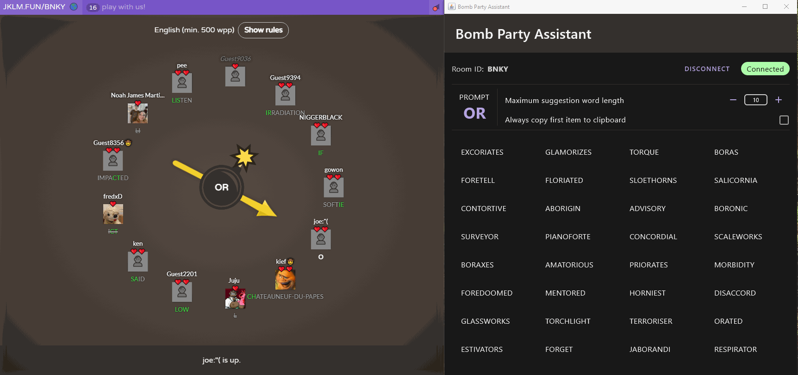

## Bomb Party Assistant

An application that helps you to come up with an answer in a bomb party game at [JKLM.fun](https://JKLM.fun) in
realtime. This application is built using desktop compose.

## Requirements

- Google Chrome version 92 and above
- Java JDK 12

## Features

- If you prefer a shorter answer, you can reduce the maximum suggested word length
- You can enable the settings to automatically copies the first suggested word to your clipboard